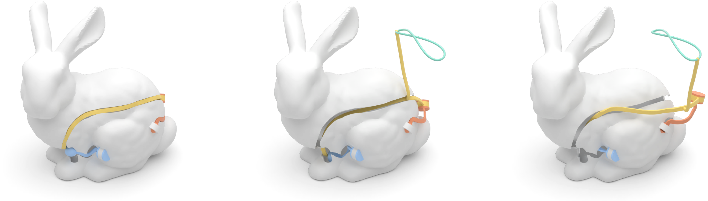
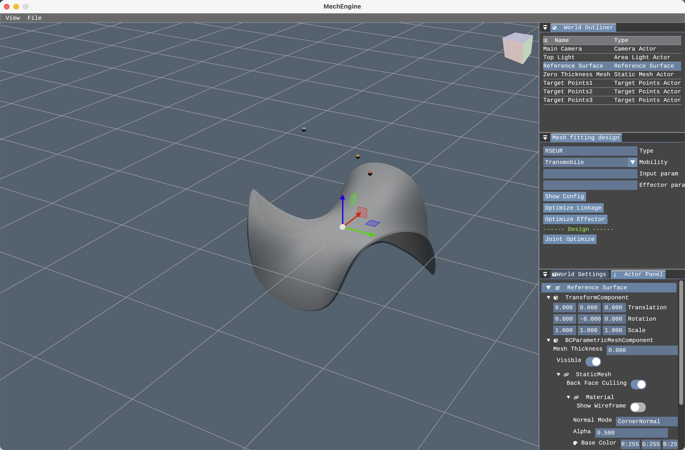
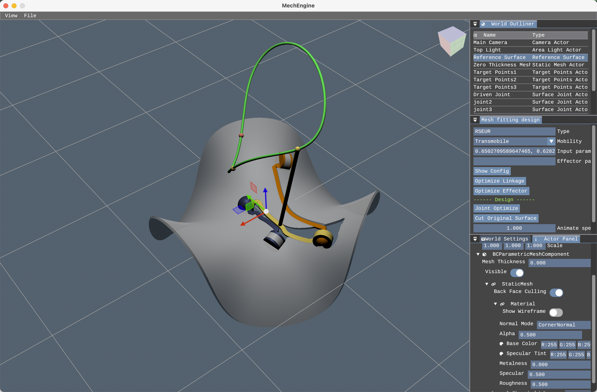
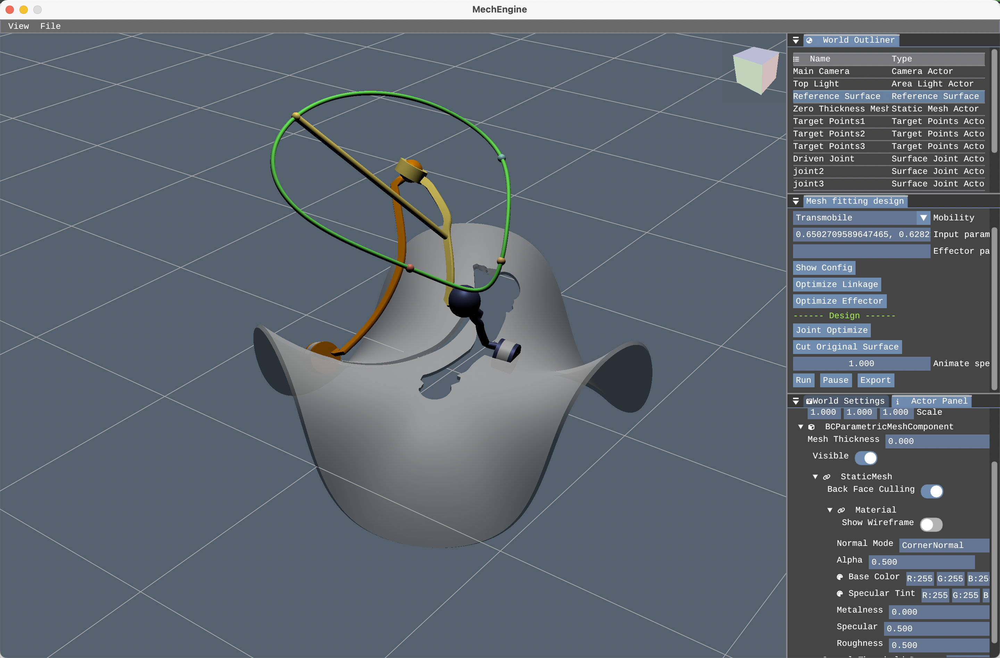

<p align="center">
 
</p>

<h3 align="center">Conformable Mechanisms on Freeform Surfaces</h3>

<div align="center">

  []() 
  [](/LICENSE)

</div>

This repo is an implementation of [Conformable Mechanisms on Freeform Surfaces](resource/Paper.pdf) [Li et al. 2025]. Commercial licensing is available upon request. If you have any problems when using this code, you can contact me any time through siqi.marvelli@gmail.com.

If you make use of this repo in your scientific work, please cite our paper. For your convenience,
you can use the following bibtex snippet:

    @article {Li-2025-ConformMech, 
    author   = {Siqi Li and Haoyu Tang and Peng Song and Bailin Deng and Jianmin Zheng}, 
    title    = {Conformable Mechanisms on Freeform Surfaces}, 
    journal  = {Computers & Graphics (Proc. of Shape Modeling International)}, 
    year     = {2025}} 

## Table of Contents
- [Table of Contents](#table-of-contents)
- [About ](#about-)
- [Getting Started ](#getting-started-)
  - [Compilation](#compilation)
- [Create a Conformable Mechanism By Yourself](#create-a-conformable-mechanism-by-yourself)
  - [Step 1: step up the environment](#step-1-step-up-the-environment)
  - [Step 2: optimize](#step-2-optimize)
  - [Step 3: visualize and export](#step-3-visualize-and-export)
- [Environment Script ](#environment-script-)
- [Authors ](#authors-)
- [Acknowledgements ](#acknowledgements-)

## About <a name = "about"></a>
This repo presents a computational approach for modeling and designing a new class of linkage mechanisms called ***conformable mechanism***. We implemented our computational design tool in C++, on a desktop computer with Intel i9 13900K processor and 32 GB RAM. 

## Getting Started <a name = "getting_started"></a>
Our code can be run on macOS, Unbuntu (Linux), and Windows system. First clone the repository 
`git clone https://github.com/Justpenz233/ConformableMechanism.git --recursive`, then run CMake to generate Makefiles or CMake/Visual Studio project files, and the rest should just work automatically.

All the dependency will be automatically set up by git submodule or CMake Fetch Content. You do not need to manually install anything. Please make sure you are connected to the internet before compiling.

### Compilation

```
$ cd [current folder path]
$ mkdir build
$ cd build
$ cmake ..
$ make -j 16
```
The integer following make -j is the number of threads supported by your CPU architecture. Replace it with your optimal value.

During the compilation, the dependencies will be automatically downloaded and built. 

## Create a Conformable Mechanism By Yourself
These instructions give an example to you of how to use our code to design a Conformable Mechanism.
We had already set up a simple example in the `Example/PathGenerationExperiment.h` file, you can simply run the code to start the GUI interface and show the example.

### Step 1: step up the environment
By modifying the environment script, you can set up the environment for your experiment (see [Environment Script](#environment-script-a-name--usagea)), or just run the binary and start from our example. You can load a reference surface mesh from an *.obj* file, and set up a set of target points/motions.
Then run the code to start the GUI interface.
You can press the 'G' key ('W' to move, 'E' to rotate) to toggle the gizmo, which can help you to drag the target points and the reference surface.

<p align="center">
 
</p>

### Step 2: optimize
You may set the desired topology (input to the 'Type') or the desired mobility (input to the 'Mobility') of the mechanism.
Then click the `Joint Optimize` button to start the optimization process. The optimization will try to find a surface that can fit the target points with the given topology and mobility.

The hyperparameters can be set in the 'ConformableMechanism/Config/DesignConfig.ini' file. 
You may focus on setting the 'InitSamples,' 'Population,' and 'Generation' parameters which control the number of initial samples, the population size, and the number of generations for the optimization process.

After the optimization process, there are lots of candidate solutions generated (the full log file can be found under "ConformableMechanism/Log"). You can copy one of the parameters to the 'Input Parameters' section, and click the `Show config` button to create a mechanism with the given parameters.
> For the example, we already provide a result config in the environment script: 0.6502709589647465, 0.6282168886620556, 0.7430210728934388, 0.36381900805623885, 0.49569553901001995, 0.40347577647275, 0.8642248601536586, 0.5153498908212903, 0.506349623454013, 0.35275068160836925, 0.3952458211677759, 0.3169246582799269, 0.1397814945594053, 0.05259153693906711, 0.5459390699887695, 0.5123256703463943, 0.5295455779352315, 0.4990459601932346, 0.559256572030057, 0.4432199901318653, 0.4985396618766895, 0.4682821690280271, 0.5010141572318725, 0.7090315921179384, 0.5267874922229296, 0.6361100468274054, 0.5667657034781767, 0.7208507944808554, 0.4371869517566465, 0.58117647306466, 0.44709947216778706, 0.42711506695351653, 0.28227445885322416
> Set the type to 'RSEUR'; Copy the parameters to the 'Input Parameters' section, and click the `Show config` button to create a mechanism with the given parameters.
Click the 'Cut original surface' button to cut the original surface according to the motion of the mechanism.

> **Optional**: You can also optimize the linkage geometry further by given an initial parameter and click the `Optimize Linkage` button.
<p align="center">
 
</p>

### Step 3: visualize and export
Lastly, you can click `Run` to visualize the animation of the mechanism. You can also click the `Export` button to export the mechanism to an *.obj* file with their motions.

<p align="center">
 
</p>

## Environment Script <a name = "usage"></a>

In this section, we will introduce how to set up an environment (a set of input) script.
The environment script is a script that spawns different objects in the scene. For our experiment, we should spawn:
- A reference surface, which could be loaded from an obj file.
- A set of target points.

Below is an example of an environment script: (More examples can be found in the `examples` folder)
```c++
inline auto ExampleExperiment()
{
	return [](World& World)
	{

        // Spawn a camera
		auto Camera = World.SpawnActor<CameraActor>("MainCamera");
		Camera->SetTranslation({-5, 0, 0});
		Camera->LookAt({0,0,0});
        // Set up the default light environment
		DefaultLightEnv(World);


        // Load the reference surface mesh and create a ReferenceSurface actor
		auto RMesh = StaticMesh::LoadObj(Path::ProjectContentDir()/"Flower.obj");
        // Solidify the mesh to create a solid mesh, as the collision mesh
		auto DMesh = Algorithm::GeometryProcess::SolidifyMeshEven(RMesh, 0.02);
        // Create a box border conformal mesh, which is used to create the reference surface
		auto ReferenceSurface = World.SpawnActor<ReferenceSurface>(
			"ReferenceSurface", DMesh, RMesh, BoxBorderConformal);
        ReferenceSurface->GetParametricMeshComponent()->GetMeshData()->GetMaterial()->SetAlpha(0.5f);

        // The original mesh is used to visualize the reference surface
        auto ZeroThickness = World.SpawnActor<StaticMeshActor>("ZeroThicknessMesh", RMesh);


        // Set up the target points
		TArray<ObjectPtr<TargetPointsActor>> TargetPoints;
		TargetPoints.push_back(World.SpawnActor<TargetPointsActor>("TargetPoints1"));
		TargetPoints.push_back(World.SpawnActor<TargetPointsActor>("TargetPoints2"));
		// ....

        // You can manually set the translation of each target point, or you can read them from a file.
		TargetPoints[0]->SetTranslation(FVector{0, -0.43, 1});
		TargetPoints[1]->SetTranslation(FVector{0.3, 0., 0.7});
        // ....
		
		TArray<FVector> TargetPointSample;
		for (const auto& i : TargetPoints)
			TargetPointSample.push_back(i->GetLocation());

        // Create our Main UI
		World.AddWidget<MeshFittingUI>(ReferenceSurface, TargetPointSample);
    };
}
```


## Authors <a name = "authors"></a>
- Siqi Li
- Haoyu Tang
- [Peng Song](https://songpenghit.github.io/)
- [Bailin Deng](http://www.bdeng.me)
- [Jianmin Zheng](https://personal.ntu.edu.sg/asjmzheng/)

## Acknowledgements <a name = "acknowledgement"></a>
We thank the reviewers for their valuable comments. This work was supported by the MOE AcRF Tier 2 Grant of Singapore (MOE-T2EP20222-0008), the MOE AcRF Tier 1 Grant of Singapore (RG12/22), and the Taith Research Mobility Funding.


